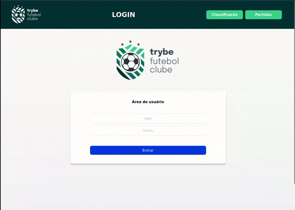

<h1 align="center">Welcome to TryBell Futebol Club 👋</h1>
<p>
  

</p>

> O TFC é um site informativo sobre partidas e classificações de futebol! ⚽️

No desenvolvimento do TFC, eu fiquei responsável por desenvolver uma API (utilizando o método TDD) e também integrar - através do docker-compose - as aplicações para que elas funcionem consumindo um banco de dados.


Nesse projeto, foi construido um back-end dockerizado utilizando modelagem de dados através do Sequelize.  O desenvolvimento respeita as regras de negócio providas no projeto e a API é capaz de ser consumida por um front-end já provido nesse projeto pela Trybe School


O back-end implementa regras de negócio para popular adequadamente a tabela disponível no front-end que será exibida para a pessoa usuária do sistema.


## E como ficará na sua tela?

## Se fores um user
<!--  email: 'user@user.com'    senha: secret_user -->


## Se fores um admin
<!--  email: 'admin@admin.com'   senha: secret_admin -->



## E atenção: apenas com a senha certa consegues acessar a edição
Abra o Readme para encontrar!

! [Pass Errada](./app/frontend/src/images/pass.gif)

## Install

```sh
npm run install:apps
```

## Docker Compose

```sh
npm run composer:up | npm run compose:down
```

## DB Seeder

⚠️ O package.json do diretório app/backend contém um script *db:reset* que é responsável por "dropar" o banco, recriar e executar as migrations e seeders. Você pode executá-lo dentro do container de backend com o comando *npm run db:reset* se por algum motivo precisar recriar a base de dados;

## Run tests

```sh
npm run test
```

## Author

👤 **IsabelMoraes**

* Github: [@IsabelMoraes](https://github.com/IsabelMoraes)
* LinkedIn: [@isabelmoraesdev](https://linkedin.com/in/isabelmoraesdev)

## Colaboraçao

Projeto desenvolvido em colaboraçao com o time da Escola Trybe durante a formaçao do curso de Desenvolvedor Fullstack

## Show your support

Give a ⭐️ if this project helped you!

***
_This README was generated with ❤️ by [readme-md-generator](https://github.com/kefranabg/readme-md-generator)_